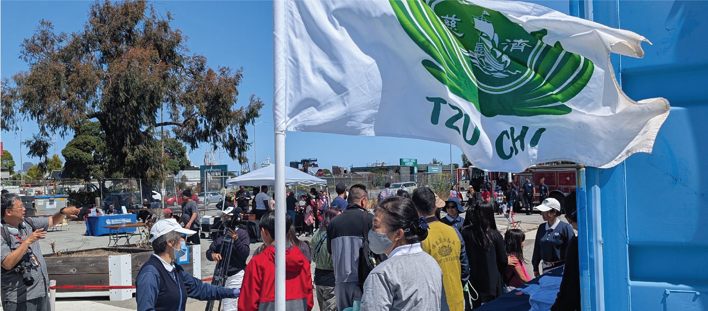
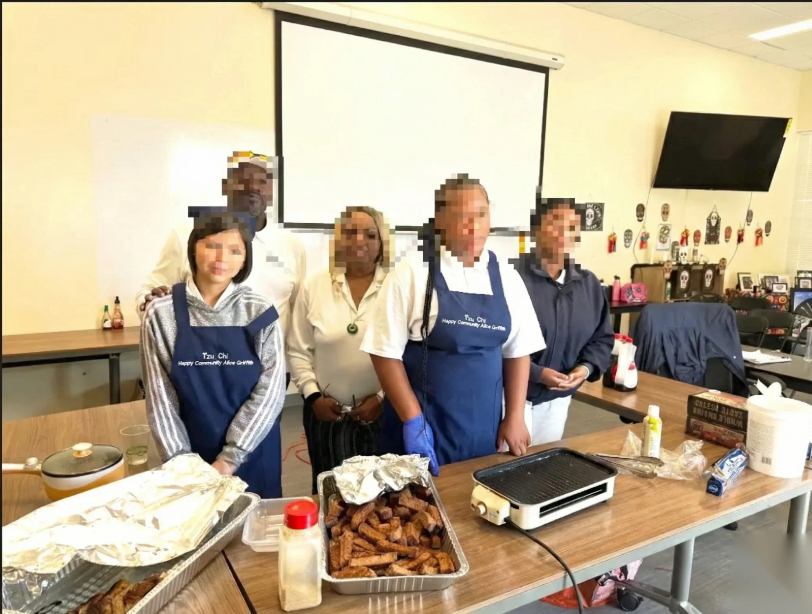
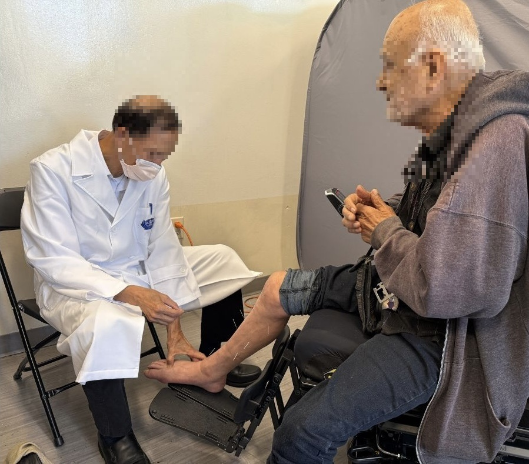
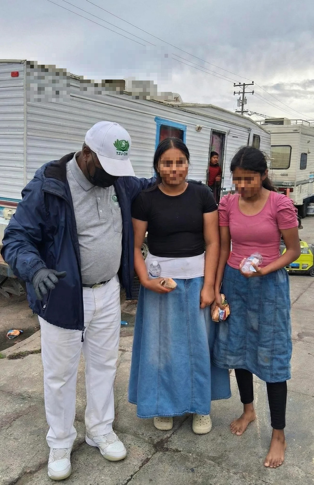
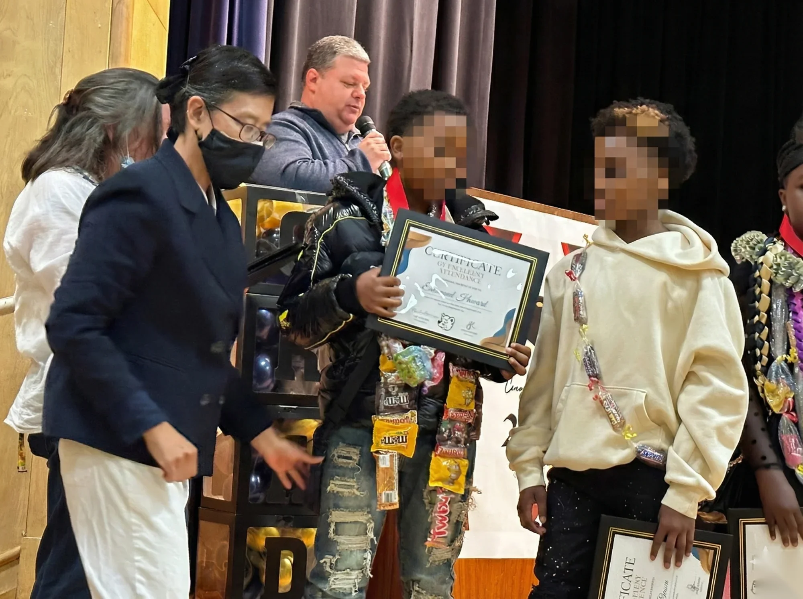

# 🪷 Journey of Kindness 善的旅程

> **A 58-year-old student's semester-long adventure: turning AI algorithms into acts of compassion.**
>
> 一位 58 歲學生的冒險：把 AI 演算法變成善的行動。

[](https://YOUR_USERNAME.github.io/journey-of-kindness/)
[](docs/Hsu_WhenAlgorithmsRemember_Final_v2.pdf)

---

## 🌟 The Story

**2006, San Francisco.** A volunteer named Roxanne saw a 7-year-old girl eating *raw, uncooked rice*. The child hadn't eaten in three days.

That moment changed everything.

**2015.** I received a kidney transplant. My daughter was the donor. Tzu Chi volunteers I'd never met drove us home and cared for us like family.

**2025.** Now I'm a 58-year-old CS student, learning AI to give back. This game is my final project — and my thank you letter to everyone who showed me compassion.

---

## 🎮 What Is This?

An **interactive game** that teaches 5 AI algorithms through real volunteer stories from San Francisco's Hunters Point community.

| Level | You Learn | By Playing |
|:-----:|-----------|------------|
| 1 | Decision Tree | Helping Mrs. Garcia make wise choices 🎯 |
| 2 | Propositional Logic | Running a Happy Campus charity shop 🏪 |
| 3 | MDP | Making food distribution decisions 🎯 |
| 4 | Search Algorithm | Exploring RV Park to find families in need 🗺️ |
| 5 | Bayesian Network | Building a community care map 💗 |

**Special Feature:** After each level, enter the **Ataraxy Portico (靜心之門)** — a moment of stillness with Jing Si Aphorisms.

---

## ✨ Features

- 🌏 **Bilingual** — English / 中文
- 📊 **ELO Rating** — Adapts to your skill level  
- 🧘 **Mindfulness Moments** — Pause and reflect between levels
- 📸 **Real Stories** — Based on 16 years of community service
- 📱 **Mobile Friendly** — Play anywhere

---

## 📊 Does It Work?

We tested with 15 students:

| What We Measured | Result |
|------------------|--------|
| Learning Improvement | **+180 ELO** (median) |
| Wanted to Volunteer After | **67%** said yes! |

Small sample, but promising! 🌱

---

## 🛠️ Built With

**Frontend:** HTML5 • CSS3 • JavaScript • TailwindCSS • Canvas API

**AI Concepts:** Decision Tree • Propositional Logic • MDP • Search Algorithm • Bayesian Networks

**Tools:** Figma • Canva • Google Analytics

---

## 📸 Real Scenes from 16 Years of Service

<details>
<summary>Click to see the real stories behind the game</summary>

### 🎒 Back to School

*Annual back-to-school event providing uniforms and supplies*

### 🍳 Vegetarian Cooking Class

*Teaching healthy plant-based cooking to community members*

### 🏥 Free Medical Services

*Traditional Chinese medicine services for underserved community*

### 🚐 RV Park Outreach

*Reaching families living in vehicles*

### 🧣 Winter Blanket Distribution

*Keeping our neighbors warm during cold months*

### 🏆 Perfect Attendance Ceremony

*Celebrating students who achieved perfect attendance*

</details>

---

## 📖 Read More

| Document | Description |
|----------|-------------|
| [📄 Research Paper](docs/Hsu_WhenAlgorithmsRemember_Final_v2.pdf) | Full academic paper: "When Algorithms Remember What We Forget" |
| [📝 Dev Timeline](docs/Journey_of_Kindness_Development_Timeline.docx) | My authentic journey building this |

---

## 🎓 Academic Context

- **Course:** CS4 Introduction to Artificial Intelligence
- **School:** Las Positas College, Honors Program
- **Professor:** An Lam
- **Semester:** Fall 2025

---

## 👩‍💻 About Me

**Mei Hsien Hsu (許美嫻)**

I'm a 58-year-old returning student proving it's never too late to learn.

- 🎓 Transferring to UC Berkeley / Stanford (2026)
- 💼 Seeking: Genentech Summer 2026 Internship
- 🪷 16 years volunteering with Tzu Chi Foundation
- 💝 Kidney transplant recipient — my daughter saved my life
- 🔬 Interested in: AI/ML, Regenerative Medicine, Exosome Research

---

## 🚀 Try It Yourself

```bash
git clone https://github.com/YOUR_USERNAME/journey-of-kindness.git
cd journey-of-kindness
# Open index.html in your browser
```

Or just [▶️ Play Online](https://YOUR_USERNAME.github.io/journey-of-kindness/)!

---

## 🙏 Thank You

- **Professor An Lam** — For believing a 58-year-old could learn AI
- **Roxanne (黃淑雲師姊)** — My mentor for 16 years
- **Tzu Chi Family** — For showing me what coordinated compassion looks like
- **My Daughter** — Who gave me her kidney and believes I can do anything
- **CS4 Classmates** — For an amazing semester together

---

## 🪷

> 「被愛的人，學會去愛」
>
> *Those who are loved, learn to love.*
>
> — Master Cheng Yen

---

*Made with 💗 in California*
